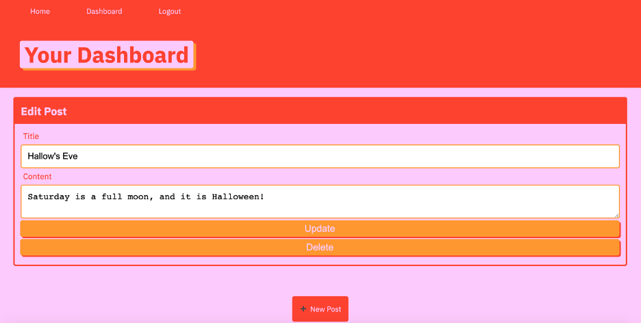

# techblog-MVC

## Description 
An interactive technology blog that allows a user to login with a username and password, or sign up. Once logged in, the user can create new posts, update and delete posts. Visitors can just view posted blogs, but cannot edit them. The blog was created through backend servers and follows the Models Views Controllers (MVC) architecture.

## Table of Contents 
* [Installation](#installation)
* [Usage](#usage)
* [Credits](#credits)
* [License](#license)

## Installation 
Git clone the repo to your local hardware. Ensure the following node packages are installed through your command line terminal: sequelize, mysql2, express, bcyrpt, express-session, express, dotenv, express-handlebars, connect-session-sequelize. 

## Usage 
To interact with the website, type "heroku open" in the command line or, follow the listed heroku app link below and paste/go in your browser. Once at the site, start the server in your command line by typing "npm start" or "node server.js", and the Heroku site will be ready to interact with.

## Heroku website link:
https://rocky-lake-14135.herokuapp.com/ 

    
## Credits 
Starter code from the UofA Coding Bootcamp

## License 
Node.js and it's packages; Heroku app

## Contributing 
If there are any open issues, view within the Github repo and follow the listed instructions to describe needed contributions.
